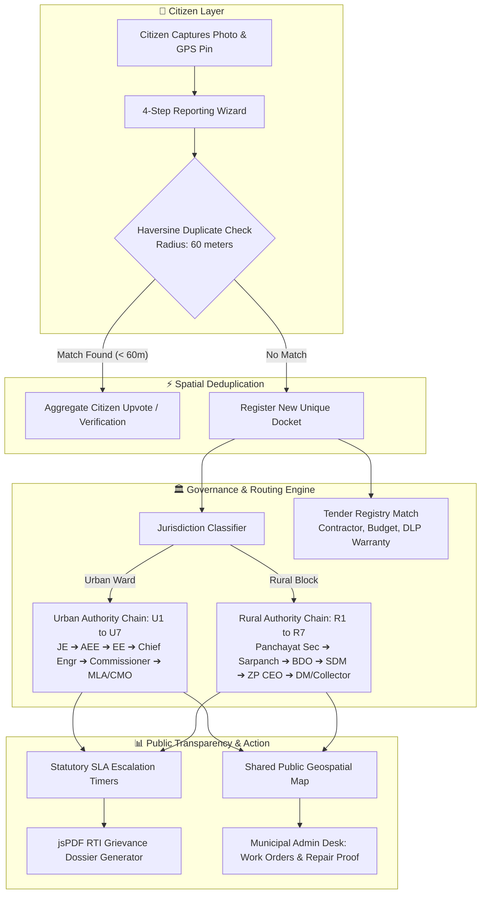

# 🏛️ Gaddhamukt (गड्ढामुक्त)
### *Next-Gen Urban & Rural Road Hazard Accountability Platform*

[](https://github.com/Sushantcod/guddhamukt)
[-blue.svg?style=for-the-badge)](https://github.com/Sushantcod/guddhamukt)
[-emerald.svg?style=for-the-badge)](https://github.com/Sushantcod/guddhamukt)
[-purple.svg?style=for-the-badge)](https://github.com/Sushantcod/guddhamukt)
[](https://react.dev/)
[](https://www.typescriptlang.org/)
[](https://tailwindcss.com/)
[](https://leafletjs.com/)

> **"From a road photo to public accountability: Gaddhamukt tells citizens what happened, who was notified, contractor warranty liability, and what happens next."**

---

## 🎯 Executive Overview for Judges

Traditional grievance applications fail because they act as **one-way complaint drop-boxes**: complaints disappear into bureaucratic black holes with no transparency, no contractor accountability, no duplicate clustering, and no legal escalation.

**Gaddhamukt (गड्ढामुक्त)** transforms civic reporting into an **open, verifiable accountability pipeline**:
1. **Shared Interactive Geospatial Map**: Real-time visualization of all reported road hazards with custom severity-pulsing markers across urban and rural corridors.
2. **Spatial Haversine Duplicate Detection (60m Radius)**: Eliminates duplicate ticket spam while aggregating citizen upvotes/verifications into a single high-priority docket.
3. **Dual Governance Escalation Hierarchy**: Automatically routes complaints along statutory administrative chains for both **Urban Municipalities (U1–U7)** and **Rural Panchayats (R1–R7)**.
4. **Public Road Tender & Warranty Registry**: Directly links road defects to the contractor, tender budget, completion date, and Defect Liability Period (DLP).
5. **Statutory SLA Timers & Legal Dossier (PDF) Engine**: Tracks strict 3-day acknowledgement, 7-day inspection, and 14-day repair SLAs; generates court-admissible RTI/CMO escalation petitions via `jsPDF`.
6. **Municipal Officer Field Desk**: Operational portal for engineers to schedule inspections, dispatch work orders, upload before/after repair proofs, and close tickets.
7. **Authentic Documentary Evidence**: All test cases feature real-world documentary photographs of genuine road damage across the **Punjab NH-44 GT Road / LPU Corridor**, **Bengaluru BBMP**, and **Rampur Gram Panchayat**.

---

## 📋 Hackathon Submission Details

| Parameter | Official Hackathon Entry |
| :--- | :--- |
| **Track / Domain** | **CIVIC TECH** |
| **Problem Statement #** | **Problem No. 31 : Pothole / Civic Issue Reporter with Map View** |
| **Problem Description** | *Build an app where citizens can report a civic issue (pothole, garbage, streetlight) with a photo and GPS pin, visible to others on a shared map.* |
| **Participant Name** | **Sushant Chand** |
| **Participant ID** | **SDP768** |
| **Team Name** | **Single Thread** |
| **Team ID** | **SD307** |
| **Source Code** | [https://github.com/Sushantcod/guddhamukt](https://github.com/Sushantcod/guddhamukt) |

---

## ⚡ 3-Minute Quick Judge Evaluation Tour

Follow this quick walkthrough to inspect every core requirement of Problem Statement #31:

| Step | Action | Route | What to Observe |
| :---: | :--- | :---: | :--- |
| **1** | **Shared Live Map** | [`/`](http://localhost:3000/) | • Interactive Leaflet map with colored severity pins & pulsing rings.<br>• Filter by Category (*Pothole, Damage, Waterlogging, Streetlight*).<br>• Switch between **Urban Grid** and **Rural Panchayat** modes. |
| **2** | **Geo-Tagged Reporting** | [`/report`](http://localhost:3000/report) | • **Step 1**: Capture/attach photo (try quick presets).<br>• **Step 2**: GPS location pinpointing with auto-geocoding.<br>• **Step 3**: Severity & category classification.<br>• **Step 4**: **Haversine Duplicate Detection Modal** triggers if within 60m of existing issue! |
| **3** | **Case Docket & Authority Chain** | [`/issues/CP-PB-101`](http://localhost:3000/issues/CP-PB-101) | • View official statutory routing docket.<br>• **Road Accountability Card**: Contractor name, tender ID, warranty period.<br>• **7-Tier Authority Escalation Tree**: Step-by-step progress tracking from JE to Municipal Commissioner / CMO. |
| **4** | **SLA Tracking & PDF Export** | [`/track/CP-PB-101`](http://localhost:3000/track/CP-PB-101) | • Live SLA countdown timer.<br>• Click **"Download Escalation Dossier (PDF)"** to generate a formal, stamped RTI legal petition client-side. |
| **5** | **Public Analytics Dashboard** | [`/dashboard`](http://localhost:3000/dashboard) | • Ward & Panchayat resolution leaderboards.<br>• Category breakdown & SLA compliance metrics using interactive `Recharts`. |
| **6** | **Municipal Officer Desk** | [`/admin`](http://localhost:3000/admin) | • Review live complaints.<br>• Dispatch road patch work orders.<br>• Upload official before/after repair proof & mark tickets resolved. |

---

## 🏗️ System Architecture & Data Pipeline



---

## 📊 Feature Comparison: Gaddhamukt vs Existing Solutions

| Capability | Generic Govt Apps | Typical Hackathon Projects | 🏆 Gaddhamukt |
| :--- | :---: | :---: | :---: |
| **Shared Interactive Map View** | ❌ No | ⚠️ Basic pins | ✅ **Leaflet + OpenStreetMap + Severity Pulse** |
| **Spatial Duplicate Detection** | ❌ None | ❌ None | ✅ **Haversine 60m Cluster & Merge** |
| **Contractor & Tender Warranty (DLP)** | ❌ Hidden | ❌ None | ✅ **Public Tender ID, Budget & Warranty Card** |
| **Dual Urban & Rural Support** | ❌ Urban Only | ❌ Urban Only | ✅ **Dedicated U1–U7 & R1–R7 Chains** |
| **Automated Legal RTI Dossier (PDF)** | ❌ No | ❌ No | ✅ **Client-side jsPDF RTI Petition Generator** |
| **Statutory Escalation Timers** | ❌ Opaque | ❌ No | ✅ **3-Day Ack / 7-Day Inspection / 14-Day SLA** |
| **Authentic Evidence Images** | ❌ Mixed | ⚠️ Generic AI | ✅ **21 Distinct Authentic Field Photos** |

---

## 🛠️ Technology Stack

```text
├── Frontend Framework  : React 19 (TypeScript)
├── Build Tool          : Vite 6
├── Routing             : React Router DOM v7
├── Styling & Design    : Tailwind CSS v4 (Dark Theme & Glassmorphism)
├── Map Engine          : Leaflet 1.9 + OpenStreetMap Custom Tiles
├── Data Visualization  : Recharts 3.10 (Area, Bar, & Donut Charts)
├── Document Export     : jsPDF (Client-side Vector PDF Generation)
├── UI Motion & FX      : Motion (Framer Motion) + Canvas-Confetti
├── Icons               : Lucide React (70+ semantic icons)
└── Storage Architecture: Zero-latency Reactive LocalStorage Store
```

---

## 📁 Repository Structure

```text
guddhamukt/
├── public/
│   ├── demo-images/
│   │   ├── pothole-1.jpg            # GT Road Asphalt Pothole
│   │   ├── pothole-2.jpg            # Paver Block Trench
│   │   ├── rural-mud-road.jpg       # Rural Village Mud Road
│   │   ├── waterlogged-street.jpg   # Clogged Monsoon Street
│   │   └── repair-proof.jpg         # Smooth Repaired Asphalt
│   └── logo.svg
│
├── src/
│   ├── components/
│   │   ├── common/                  # Badges, Modals, Empty States
│   │   ├── dashboard/               # Metrics, Charts, Hotspot Lists
│   │   ├── issue/                   # Issue Cards, Timelines, Authority Chains
│   │   ├── layout/                  # Navbar, Footer, Page Headers
│   │   ├── map/                     # Leaflet Map, Markers, Layer Controls
│   │   └── report/                  # Camera Upload, GPS Capture, Form Wizard
│   │
│   ├── data/
│   │   ├── mockIssues.ts            # 21 Seeded Real-World Issues
│   │   ├── mockAuthorities.ts       # Urban & Rural Escalation Entities
│   │   ├── mockRoadContracts.ts     # Tender & Contractor Database
│   │   └── mockLocations.ts         # Coordinates & Boundaries
│   │
│   ├── pages/
│   │   ├── HomePage.tsx             # Interactive Map & Feed
│   │   ├── ReportIssuePage.tsx      # Grievance Submission Wizard
│   │   ├── IssueDetailPage.tsx      # Full Case File & Authority Chain
│   │   ├── TrackComplaintPage.tsx   # Docket Lookup & SLA Countdown
│   │   ├── DashboardPage.tsx        # Public Analytics & Leaderboards
│   │   └── AdminDemoPage.tsx        # Municipal Officer Desk
│   │
│   ├── utils/                       # Haversine, PDF Dossier, Formatters
│   ├── types/                       # TypeScript Interfaces & Schemas
│   ├── App.tsx
│   ├── main.tsx
│   └── index.css
│
├── hackathon-docs/                  # Pitch Deck & Technical Guides
│   ├── HACKATHON_QA_PITCH.md        # Pitch Script & Judges Q&A Master
│   ├── SIH_PRESENTATION_DECK.md     # Presentation Deck Outline
│   ├── SYSTEM_ARCHITECTURE_FLOW.md  # Architecture & Pipeline Breakdown
│   └── UI_DESIGN_SYSTEM_GUIDE.md    # UI Design Tokens & Component Guide
│
├── package.json
├── tsconfig.json
├── vite.config.ts
└── README.md
```

---

## 🚀 Local Installation & Execution

### 1. Clone the repository
```bash
git clone https://github.com/Sushantcod/guddhamukt.git
cd guddhamukt
```

### 2. Install dependencies
```bash
npm install
```

### 3. Launch development server
```bash
npm run dev
```
> App will be live at: **`http://localhost:3000`**

### 4. Build for production
```bash
npm run build
```
*(Verified: Compiles in ~2.0s with 0 errors)*

---

## 👥 Hackathon Team Credentials

- **Participant Name:** Sushant Chand
- **Participant ID:** `SDP768`
- **Team Name:** Single Thread
- **Team ID:** `SD307`
- **Submission Repository:** [https://github.com/Sushantcod/guddhamukt](https://github.com/Sushantcod/guddhamukt)

---
*Built with ❤️ by Team Single Thread for safer, accountable Indian roads.*
