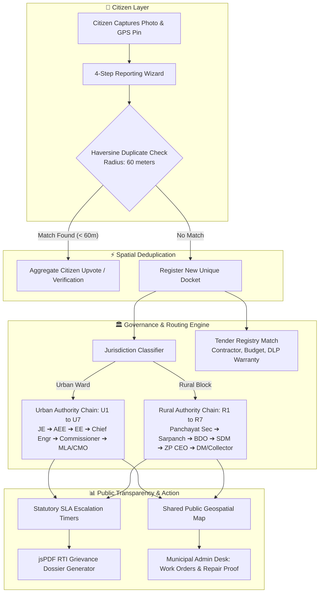

# Gaddhamukt (गड्ढामुक्त) — Pothole & Civic Issue Accountability Platform

> **From a road photo to public accountability: Gaddhamukt tells citizens what happened, who was notified, and what happens next.**

---

## 🏆 Hackathon Project Information

| Field | Details |
| :--- | :--- |
| **Track / Domain** | **CIVIC TECH** |
| **Problem Statement** | **Problem No. 31 : Pothole / Civic Issue Reporter with Map View** |
| **Requirement** | *Build an app where citizens can report a civic issue (pothole, garbage, streetlight) with a photo and GPS pin, visible to others on a shared map.* |
| **Participant Name** | **Sushant Chand** |
| **Participant ID** | **SDP768** |
| **Team Name** | **Single Thread** |
| **Team ID** | **SD307** |
| **Repository** | [https://github.com/Sushantcod/guddhamukt](https://github.com/Sushantcod/guddhamukt) |

---

## 🌟 Key Features

### 1. 🗺️ Shared Interactive Civic Map
- **Live GPS Pins**: Real-time visualization of all reported road hazards (Potholes, Road Damage, Waterlogging, Streetlights, Footpath Hazards) across urban and rural corridors.
- **Visual Severity Encoding**: Color-coded map markers for *Immediate Danger* (Red Pulsing), *High* (Orange), *Medium* (Amber), and *Low* (Slate).
- **Cluster & Radius Filtering**: Live radius proximity, category filters, and quick toggle between Urban (Bengaluru/Phagwara) and Rural (Rampur Panchayat/Chaheru).

### 2. 📸 4-Step Citizen Grievance Reporting Flow
- **Photo & Camera Evidence**: Upload authentic photos or test with realistic field damage presets.
- **GPS Coordinates & Auto-Geocoding**: Automatic latitude/longitude capture with reverse geocoding to identify ward/village jurisdiction.
- **Spatial Duplicate Detection**: Uses the Haversine formula (60m radius) to prevent duplicate spam, allowing citizens to upvote/verify existing complaints.

### 3. 🏛️ Dual Urban & Rural Governance Architecture
- **Urban Chain (U1–U7)**: Ward Junior Engineer ➔ Sub-Division AEE ➔ Executive Engineer ➔ Zonal Chief Engineer ➔ Special Commissioner (Projects) ➔ Municipal Commissioner ➔ MLA & CM Grievance Cell.
- **Rural Chain (R1–R7)**: Gram Panchayat Secretary ➔ Sarpanch & Ward Member ➔ Block Development Officer (BDO) ➔ Sub-Divisional Magistrate (SDM) ➔ Zilla Parishad CEO ➔ District Collector / DM ➔ State Rural Roads Agency (PMGSY).

### 4. 📜 Public Road Tender & Accountability Registry
- Transparent public registry linking every road segment to its **Contractor Name**, **Tender ID**, **Sanctioned Budget**, **Completion Date**, and **Warranty/Defect Liability Period (DLP)**.

### 5. ⏳ Statutory SLA Escalation & Automated Dossier Generator
- Countdown timers tracking acknowledgement (3 days), field inspection (7 days), and repair completion (14 days).
- One-click **PDF Grievance Dossier** generation via `jsPDF` formatted for formal RTI petitions, Municipal Commissioners, and Jansunwai portals.

### 6. 📊 Civic Analytics & Ward Leaderboards
- High-level KPI metrics (Total Issues, Resolution Rate, Overdue Escalations, Avg. Resolution Time).
- Ward and Panchayat performance charts built with `recharts`.

### 7. 🛠️ Municipal Admin Inspection Desk
- Simulated government portal to review citizen tickets, dispatch road repair work orders, upload official repair proofs, and close verified complaints.

---

## 📸 Authentic Real-World Visuals
All 21 seeded test cases (including the **Punjab NH-44 GT Road / LPU Corridor**, **Urban Bengaluru**, and **Rampur Gram Panchayat**) feature authentic, realistic documentary photographs of actual road damage, asphalt cavities, broken paver blocks, waterlogged streets, and repair patch proofs.

---

## 🏗️ System Architecture & Data Pipeline



---

## 📊 Feature Comparison: Gaddhamukt vs Existing Solutions

| Capability | Generic Govt Apps | Typical Hackathon Projects | 🏆 Gaddhamukt |
| :--- | :---: | :---: | :---: |
| **Shared Interactive Map View** | ❌ No | ⚠️ Basic pins | ✅ **Leaflet + OpenStreetMap + Severity Pulse** |
| **Spatial Duplicate Detection** | ❌ None | ❌ None | ✅ **Haversine 60m Cluster & Merge** |
| **Contractor & Tender Warranty (DLP)** | ❌ Hidden | ❌ None | ✅ **Public Tender ID, Budget & Warranty Card** |
| **Dual Urban & Rural Support** | ❌ Urban Only | ❌ Urban Only | ✅ **Dedicated U1–U7 & R1–R7 Chains** |
| **Automated Legal RTI Dossier (PDF)** | ❌ No | ❌ No | ✅ **Client-side jsPDF RTI Petition Generator** |
| **Statutory Escalation Timers** | ❌ Opaque | ❌ No | ✅ **3-Day Ack / 7-Day Inspection / 14-Day SLA** |
| **Authentic Evidence Images** | ❌ Mixed | ⚠️ Generic AI | ✅ **21 Distinct Authentic Field Photos** |

---

## 🛠️ Technology Stack

```text
├── Frontend Framework  : React 19 (TypeScript)
├── Build Tool          : Vite 6
├── Routing             : React Router DOM v7
├── Styling & Design    : Tailwind CSS v4 (Dark Theme & Glassmorphism)
├── Map Engine          : Leaflet 1.9 + OpenStreetMap Custom Tiles
├── Data Visualization  : Recharts 3.10 (Area, Bar, & Donut Charts)
├── Document Export     : jsPDF (Client-side Vector PDF Generation)
├── UI Motion & FX      : Motion (Framer Motion) + Canvas-Confetti
├── Icons               : Lucide React (70+ semantic icons)
└── Storage Architecture: Zero-latency Reactive LocalStorage Store
```

---

## 📁 Project Directory Structure

```text
guddhamukt/
├── public/
│   ├── demo-images/
│   │   ├── pothole-1.jpg            # GT Road Asphalt Pothole
│   │   ├── pothole-2.jpg            # Paver Block Trench
│   │   ├── rural-mud-road.jpg       # Rural Village Mud Road
│   │   ├── waterlogged-street.jpg   # Clogged Monsoon Street
│   │   └── repair-proof.jpg         # Smooth Repaired Asphalt
│   └── logo.svg
│
├── src/
│   ├── components/
│   │   ├── common/                  # Badges, Modals, Empty States
│   │   ├── dashboard/               # Metrics, Charts, Hotspot Lists
│   │   ├── issue/                   # Issue Cards, Timelines, Authority Chains
│   │   ├── layout/                  # Navbar, Footer, Page Headers
│   │   ├── map/                     # Leaflet Map, Markers, Layer Controls
│   │   └── report/                  # Camera Upload, GPS Capture, Form Wizard
│   │
│   ├── data/
│   │   ├── mockIssues.ts            # 21 Seeded Real-World Issues
│   │   ├── mockAuthorities.ts       # Urban & Rural Escalation Entities
│   │   ├── mockRoadContracts.ts     # Tender & Contractor Database
│   │   └── mockLocations.ts         # Coordinates & Boundaries
│   │
│   ├── pages/
│   │   ├── HomePage.tsx             # Interactive Map & Feed
│   │   ├── ReportIssuePage.tsx      # Grievance Submission Wizard
│   │   ├── IssueDetailPage.tsx      # Full Case File & Authority Chain
│   │   ├── TrackComplaintPage.tsx   # Docket Lookup & SLA Countdown
│   │   ├── DashboardPage.tsx        # Public Analytics & Leaderboards
│   │   └── AdminDemoPage.tsx        # Municipal Officer Desk
│   │
│   ├── utils/                       # Haversine, PDF Dossier, Formatters
│   ├── types/                       # TypeScript Data Schemas
│   ├── App.tsx
│   ├── main.tsx
│   └── index.css
│
├── hackathon-docs/                  # Presentation Deck & Architecture Guides
│   ├── HACKATHON_QA_PITCH.md        # Pitch Script & Judges Q&A
│   ├── SIH_PRESENTATION_DECK.md     # Slide Deck Notes
│   ├── SYSTEM_ARCHITECTURE_FLOW.md  # Architecture & Pipeline Breakdown
│   └── UI_DESIGN_SYSTEM_GUIDE.md    # UI Design System & Component Guide
│
├── package.json
├── tsconfig.json
├── vite.config.ts
└── README.md
```

---

## 🚀 Quick Start Guide

### Prerequisites
- Node.js (v18 or higher recommended)
- npm or bun

### 1. Clone the repository
```bash
git clone https://github.com/Sushantcod/guddhamukt.git
cd guddhamukt
```

### 2. Install dependencies
```bash
npm install
```

### 3. Start development server
```bash
npm run dev
```
Open [http://localhost:3000](http://localhost:3000) in your browser.

### 4. Build for production
```bash
npm run build
```

---

## 📤 Step-by-Step GitHub Upload Guide

To upload this project to your GitHub account:

1. **Create a new repository on GitHub**:
   - Go to [https://github.com/new](https://github.com/new)
   - Repository name: `guddhamukt` (or `civic-issue-reporter`)
   - Description: `Problem 31 - Pothole/Civic Issue Reporter with Map View | Team Single Thread`
   - Set to **Public** and do NOT check "Add a README file" (we already have one).
   - Click **Create repository**.

2. **Push your local code via Terminal**:
   ```bash
   # Inside the /guddhamukt directory
   git init
   git add .
   git commit -m "feat: Civic Tech Problem 31 - Pothole & Civic Issue Accountability Platform"
   git branch -M main
   git remote add origin https://github.com/Sushantcod/guddhamukt.git
   git push -u origin main
   ```

---

## 👥 Team Details

- **Participant Name**: Sushant Chand
- **Participant ID**: SDP768
- **Team Name**: Single Thread
- **Team ID**: SD307
- **Project Domain**: CIVIC TECH (Problem #31)
