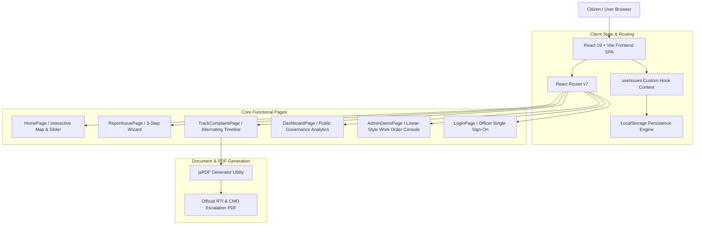

# 🏗️ Gaddhamukt — System Architecture & Data Flow Guide

This document outlines the technical architecture, data pipeline, component hierarchy, and state synchronization flow powering the **Gaddhamukt Civic Road Platform**.

---

## 1. System Architecture Overview



---

## 2. Directory & Component Hierarchy

```
guddhamukt/
├── public/
│   ├── demo-images/         # High-resolution asphalt compaction & pothole photos
│   └── logo.svg             # Gaddhamukt vector branding logo
├── src/
│   ├── assets/              # Static vector assets
│   ├── components/
│   │   ├── common/          # Reusable UI components
│   │   │   ├── Logo.tsx     # Brand logo component
│   │   │   ├── TypingText.tsx # Animated typewriter text effect
│   │   │   └── EmptyState.tsx # Clean empty state placeholder
│   │   ├── dashboard/       # Public governance analytics
│   │   │   ├── MetricCard.tsx # KPI metric cards
│   │   │   ├── WardChart.tsx  # Recharts resolution breakdown
│   │   │   └── HotspotList.tsx# High-risk defect leaderboard
│   │   ├── issue/           # Grievance & timeline components
│   │   │   ├── IssueCard.tsx  # Pothole card item
│   │   │   ├── IssueMap.tsx   # Leaflet geospatial map
│   │   │   ├── IssueTimeline.tsx # Alternating left/right step timeline
│   │   │   └── StatusBadge.tsx# Status & severity badges
│   │   ├── layout/          # Application shell layout
│   │   │   ├── Navbar.tsx     # Tubelight pill navbar with lamp glow
│   │   │   ├── Footer.tsx     # Civic helpdesk footer with beating heart
│   │   │   └── PageHeader.tsx # Header strip for pages
│   │   └── ui/              # Interactive UI showcases
│   │       ├── RoadRepairShowcase.tsx # Before/After drag slider & 3-stage proof
│   │       └── GlobeComponent.tsx    # Re-exports RoadRepairShowcase
│   ├── data/                # Initial seed datasets
│   │   ├── mockIssues.ts    # Punjab LPU, Bengaluru & Rampur issues
│   │   ├── mockRoadContracts.ts # Tender & contract liability data
│   │   └── mockAuthorities.ts   # Municipal officer directory
│   ├── hooks/
│   │   └── useIssues.ts     # Central state management hook with LocalStorage sync
│   ├── pages/               # Top-level view routes
│   │   ├── HomePage.tsx
│   │   ├── ReportIssuePage.tsx
│   │   ├── IssueDetailPage.tsx
│   │   ├── TrackComplaintPage.tsx
│   │   ├── DashboardPage.tsx
│   │   ├── AdminDemoPage.tsx
│   │   └── LoginPage.tsx
│   ├── types/               # TypeScript interfaces & types
│   │   └── index.ts
│   ├── utils/               # Helper functions
│   │   ├── generateComplaintPdf.ts # jsPDF dossier generator
│   │   ├── issueHelpers.ts       # Formatting & SLA calculations
│   │   └── escalationHelpers.ts  # Statutory escalation rules
│   ├── App.tsx              # Main layout & AnimatePresence route transitions
│   └── main.tsx             # Entry point
```

---

## 3. Data Pipeline & State Synchronization

1. **State Initialization**:
   - `useIssues.ts` initializes state by checking `localStorage.getItem('gaddhamukt_issues')`.
   - If empty, it seeds the state with `INITIAL_MOCK_ISSUES` (including Punjab LPU `CP-PB-101`, Bengaluru `CP-90210`, and Rampur `CP-RUR-501`).

2. **Grievance Lifecycle**:
   ```
   [Reported] ──► [Routed to Ward/Panchayat] ──► [Acknowledged by JE]
                                                        │
   [Resolved & Verified] ◄── [Repair In Progress] ◄─────┘
   ```

3. **PDF Generation**:
   - When a citizen clicks **Download Official PDF Packet**, `generateComplaintPdf()` constructs a multi-page document incorporating:
     - Grievance Metadata & Geolocation coordinates.
     - Road Tender & Contractor Defect Liability terms.
     - Timestamped Timeline Audit log.
     - Formatted RTI Section 72 Complaint Notice for submission to Chief Minister's Office (CMO).

---

## 4. Key Performance Optimizations

- **Vite 6 Bundling**: Minified bundle size with tree-shaking.
- **Client-Side Storage**: Instant state updates with zero network latency.
- **Leaflet Map Rendering**: Dynamic marker icons optimized for high marker counts.
- **Motion Animations**: GPU-accelerated CSS transitions powered by `motion/react`.
